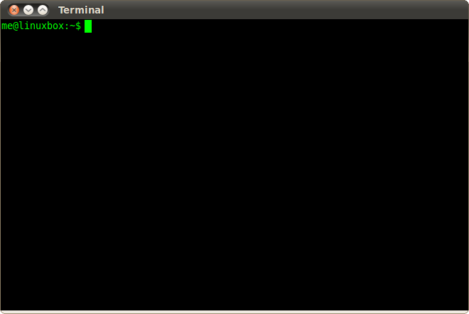

:title: Python For Beginners
:author: Paul Logston
:description: A python tutorial prepared for NYC PyLadies
:keywords: python, beginners, tutorial, NYC, PyLadies
:css: css/presentation.css

----

NYC Pyladies Presents!
======================
Python for Beginners: Part I
-----------------------------

.. image:: media/pyladies_logo.jpeg
  :height: 200
  :width: 200
  :scale: 50

=========  =====
WiFi
================
SSID:       *<POP>*
Passowrd:   *<>*
=========  =====

Thursday, Feb. 27th 2014

<Location>

----

Who's Here
==========

- Paul (me)
- Tobi

----

Special Thanks
==============

Barbara Shaurette
-----------------

Many of these presentations slides are copies of or 
based off of `her slides`_.

.. _her slides: https://github.com/mechanicalgirl/intro-to-python/blob/master/IntrotoPython_Austin_July202013.pdf

----

What We Are Going To Cover
==========================
- Starting Python
- Types + Operations
- Variables
- Conditional Constructs (if-else)
- Loops
- Functions
- Exceptions
- Modules and Imports

----

What We Need
============

A Text Editor
-------------
  
- Notepad (Win)
- TextEdit (Mac)
- Sublime Text (Unisex)

A Command Line
--------------
``...``

----

.. image:: media/command_line.jpg
  :height: 300px

----

Start Python
============

From the command line, type::

  python

What we should see

.. image:: media/python_shell.png
  :width: 1000px

----

Lets Talk Python!
=================

What is python?

----

Python
======

A *program* that can take my 
*instructions* and act on them.

|

Why Python
----------

- Readable syntax
- Lots of packages
- Open Source!

----

Numbers
=======

::
  
  2
  4L
  -1
  0
  10e-4
  2.27

----

Numbers
=======

What we can do with numbers...

::

  >>> 2 + 2
  4
  >>> 5 - 2
  3
  >>> 14 - 27
  -13

----

Numbers
=======

Try these...

::

  >>> 4 + 20
  >>> 500 - 7
  >>> 4L - 1

----

Numbers
=======

What about multiplication and division?

We use ``*`` for multiplication and ``/`` for division.

::

  >>> 2 * 3
  >>> 4 * 40
  >>> 200 / 10
  >>> 91 / 7

----

Numbers
=======

What if the division produces a remainder?

::

  >>> 7 / 3
  ?

----

Numbers
=======

| ``/`` is the floor division operator in Python 2.x
| ``/`` is the division we probably expect operator in Python 3.x

If we want Python 2.x to return a float from a ``/`` operation,
we need one of the operands to be a float.

::
  
  >>> 2.0 / 5
  0.4
  >>> float(2) / 5
  0.4

----

Equality Operators
==================

Not necessarily for numbers

::

  ==
  !=
  <
  >
  <=
  >=

----

Equality Operators
==================

::
  
  >>> 5 == 5
  True
  >>> 5 == 1
  False
  >>> 5 != 1
  True
  >>> "PyLadies" == "PyLadies"
  True

----

Equality Operators
==================

Try these...

::

  >>> 'Pi' == 'Pi'
  >>> 'Pi' == 3.14
  >>> 3.14 == 3.14

----

Bools
=====

There are only two. 

``True`` & ``False``

::

  >>> True
  True

::

  >>> if True:
          do this ...

::

  >>> there_will_be_dancing = True

----

Bools
=====

Try these...

::

  >>> if True:
          print ('Ziggy Zag')

::

  >>> if False:
          print ('Ancient Fossils')

----

Bools
=====

Other values (like numbers, strings, and variables)
can be ``Truthy`` or ``Falsy``.

::

  >>> if there_will_be_dancing:
          put_on_dancing_shoes()

::
  
  >>> while there_will_be_dancing:
          drink_plenty_of_fluids()

----

Bools
=====

Falsy objects...
----------------

- ``None``
- ``False``
- Zero of any numeric type; ``0``, ``0L``, ``0.0``, ``0j``.
- Any empty sequence, for example, ``''``, ``()``, ``[]``.
- Any empty mapping, for example, ``{}``.
- Class instances, sometimes (more on this later)

----

Bools
=====

Truthy objects...
-----------------

- Eveything else

----

Bools
=====

The ``not`` operator
--------------------

::

  >>> if not True:
          handle_a_false_case

----

Bools
=====

Try these...

::

  >>> if "":
          print ('Mango')
  >>> if not "":
          print ('Sushi')
  >>> if 500:
          print ('Indy')
  >>> if None:
          print (5)
  >>> if ():
          print ('Tuples!')

----

Strings!
========

.. image:: media/business-cat-meme-the-sales-contract-had-strings-attached.jpg
  :width: 450px

----

Strings
=======

``"I'm a string!"``

What makes a string a string?

::

  >>> 'single quotes!'
  >>> "double quotes!"
  >>> str(10)

----

Strings
=======

Try these...

::

  >>> "Who's there?"
  >>> '1'
  >>> ''
  >>> str(7)

---- 

Strings
=======

Joining Strings (Concatenation)
-------------------------------

The more expensive way

::

  >>> 'a' + 'b' + 'c'
  'abc'
  >>> '1' + '2' + '3'
  '123'

----

Strings
=======

Try these...

::

  >>> 'Hello' + 'World'
  >>> 'Hello' + ' ' + 'World'

----

``print``!
==========

What does it do?
----------------

The job of ``>>>`` (REPL) is to print, so it prints almost everything.

But what if we want to make a script out side of a REPL?

We need some way to tell python to print something to the screen.

- print in Python 2    
  - ``print``
- print in Python 3
  - ``print()``

We will be using ``print ()`` for the rest of this tutorial.

----

``print``
=========

::

  >>> print ('Moose!')
  Moose
  >>> print (-1)
  -1
  >>> print ('')

  >>>

----

``print``
=========

Try these...

::

  >>> print ('New York')
  >>> print (2014 * 1e10)
  >>> print ()

----

Comments & Docstrings
=====================

I want some words to remember what I was doing here
but I don't want them to print out.

::
  
  # I am a comment. I have to stay on one line.

  """
  I am a docstring.
  I can span
    multiple lines
      and can preserve indentation!
  """

----

Variables

What is a variable

A box to but a value in, a way to store a value

----

Variables examples

----

Variables exercises with numbers

----

Variable exercises with strings

----

variable exercises with bools

----

logic examples with variables

----

BREAK

----

Data Structures
===============

Lists

----

Lists Examples

----

List Excersies

----

Dictionaries

----

Why use a dictionary over a list

----

Dictionary examples

----

Dictionary excersises

----

Conditionals
============

if elif else 

----

Conditional examples

----

Conditional excersices

----

Loops!
======

while 
for

----

while examples

----

while excersies

----

while else

----

for in 

----

for in examples

----

for in excersies

----

Errors

----

Errors examples

----

Error excersises

----

Exercises parse a traceback and tell me whats going on

----

Functions
=========

I wanna do it again

----

Functions

----

Functions examples

----

Functions excersises

----

Could we have a function that returns a function?

----

raw_input excersise

----

import
======

I want to use someone else's functions

----

import examples

----

import excersises

----

Objects
=======

I want to make functions that go with my data.

----

Object examples

----

Objects excersises

----

Thanks!

----

Check out these meetups!

----

Bibliography

